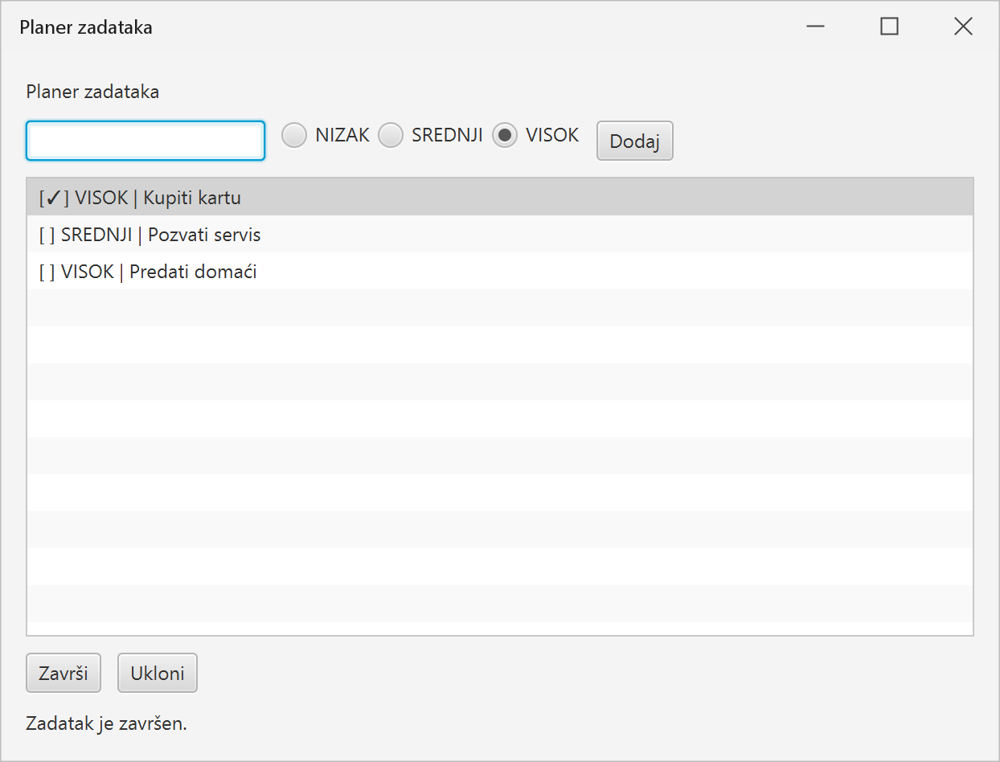
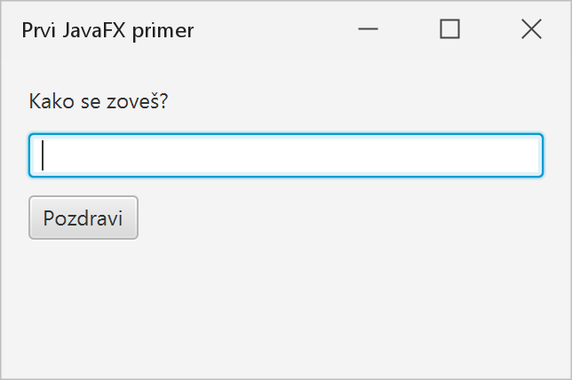
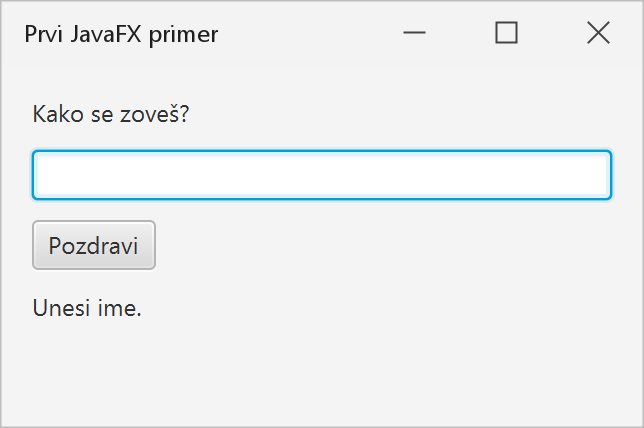
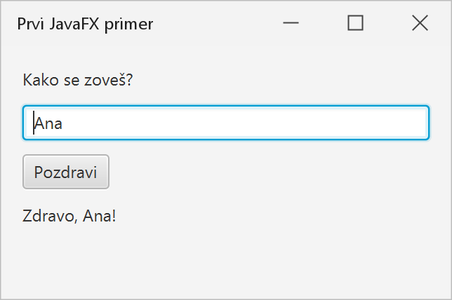
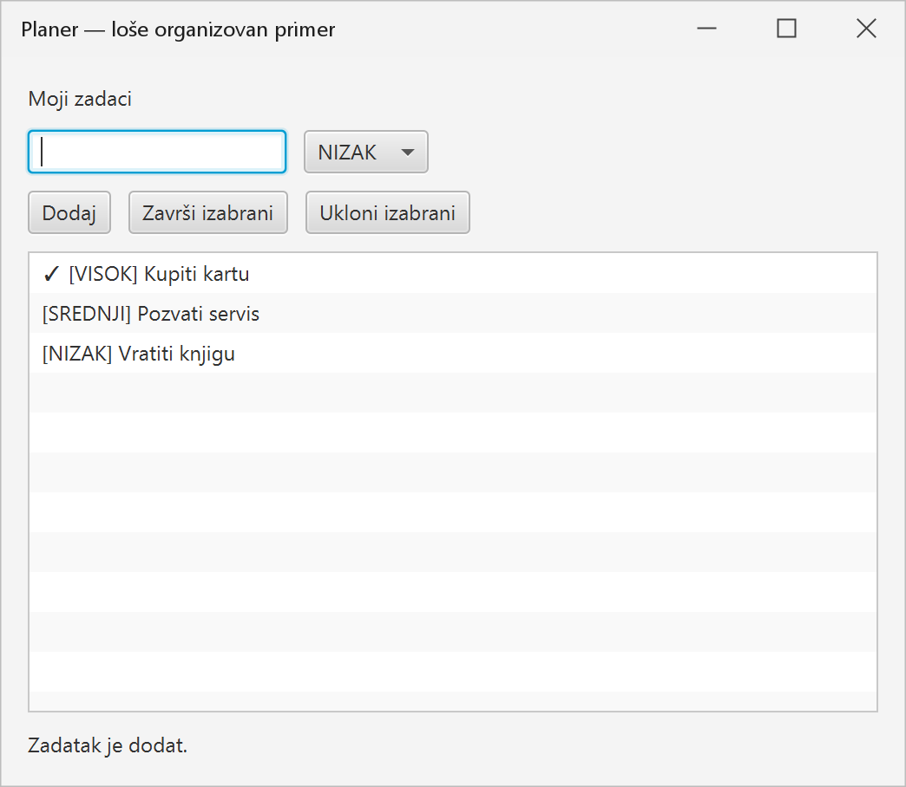
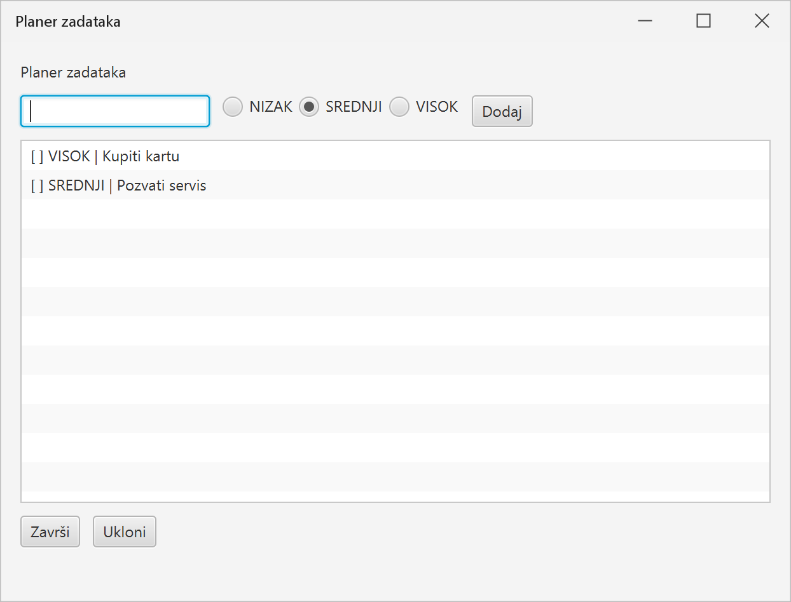
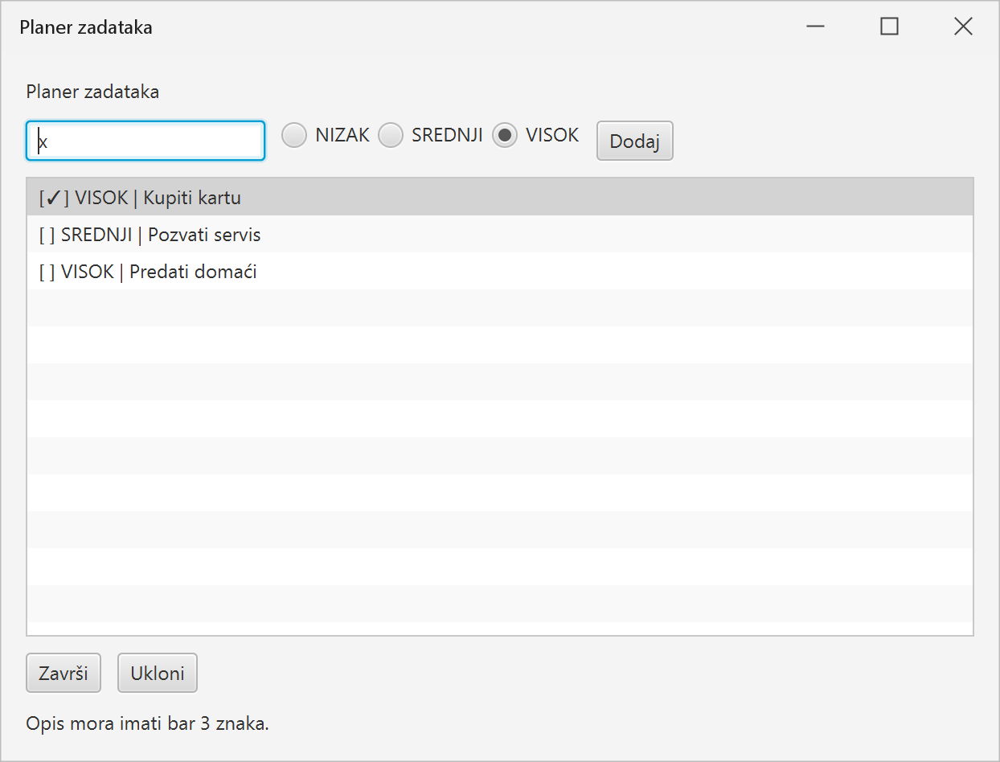

# Nedelja 12 — JavaFX i odvajanje modela od korisničkog interfejsa

> **Kod:** [GitHub](https://github.com/MatfOOP-I/info/tree/main/vezbe/primeri-java/12.javafx.odvajanje.modela.i.ui) · [preuzmi projekat (ZIP)](../12.javafx.odvajanje.modela.i.ui.zip) · [zadatak za samostalni rad](ZADATAK.md)

Ove nedelje prvi put pravimo grafičku aplikaciju.

Cilj nije samo da naučimo:

```text
Button
Label
TextField
VBox
HBox
ListView
ChoiceBox
RadioButton
ToggleGroup
```

nego i da zadržimo OOP principe koje smo gradili tokom celog kursa.

Najvažnija poruka ove nedelje je:

> **Korisnički interfejs nije model programa.**

JavaFX treba da:

- prikaže podatke;
- pročita korisnički unos;
- reaguje na događaje;
- pozove odgovarajuću operaciju aplikacije;
- ponovo osveži prikaz.

Pravila domena i stanje aplikacije ne treba da žive u `Button` handlerima.

## Šta pravimo

Na kraju časa imaćemo planer zadataka: unos opisa, izbor prioriteta, lista zadataka i dugmad za završavanje i uklanjanje.



Do njega stižemo u nekoliko koraka, od najjednostavnijeg prozora do aplikacije sa razdvojenim modelom, kontrolerom i prikazom.

---

## Domen

Pravimo jednostavan planer zadataka.

Zadatak ima:

- opis;
- prioritet;
- informaciju da li je završen.

Prioritet je:

```java
public enum Prioritet {
    NIZAK,
    SREDNJI,
    VISOK
}
```

Aplikacija treba da omogući:

- dodavanje zadatka;
- prikaz svih zadataka;
- označavanje izabranog zadatka kao završenog;
- uklanjanje zadatka.

Domen je namerno jednostavan.

Nova tema ove nedelje treba da bude **organizacija GUI aplikacije**, a ne razumevanje poslovnog domena.

---

## Ciljevi

Posle vežbi student treba da ume da:

- objasni osnovni životni ciklus JavaFX aplikacije;
- razlikuje `Stage`, `Scene` i JavaFX kontrole;
- koristi osnovne layout kontejnere;
- reaguje na događaj dugmeta;
- objasni šta je event handler;
- prepozna problem kada UI direktno čuva i menja stanje domena;
- izdvoji model u obične Java klase;
- napravi UI koji koristi model, ali model ne zna da JavaFX postoji;
- razume ulogu malog kontrolera između prikaza i modela;
- objasni smer zavisnosti između slojeva.

---

## Željeni smer zavisnosti

U završnom primeru imamo:

```text
        JavaFX
          |
          v
       prikaz
          |
          v
      kontroler
          |
          v
        model
```

Dozvoljeno je:

```text
prikaz      → kontroler
kontroler   → model
prikaz      → model   (samo radi prikaza podataka)
```

Nije dozvoljeno:

```text
model → javafx.*
```

Model ne treba da zna:

- da postoji dugme;
- da postoji `TextField`;
- da postoji `ListView`;
- da postoji prozor;
- koje je boje tekst;
- šta se dešava kada korisnik klikne.

---

## Zašto je to važno?

Ako je model obična Java:

```java
ListaZadataka lista = new ListaZadataka();
lista.dodaj("Kupiti kartu", Prioritet.VISOK);
```

onda isti model možemo koristiti:

- iz JavaFX aplikacije;
- iz konzolnog programa;
- iz testova;
- jednog dana iz nekog drugog UI-ja.

Ako poslovna logika živi u:

```java
dugme.setOnAction(...)
```

onda je ona vezana za konkretan UI.

---

## Redosled primera

### [`primer01_osnove`](https://github.com/MatfOOP-I/info/tree/main/vezbe/primeri-java/12.javafx.odvajanje.modela.i.ui/src/primer01_osnove)

Minimalna JavaFX aplikacija.

Uvodimo:

```text
Application
start(...)
Stage
Scene
VBox
Label
TextField
Button
```

i prvi događaj:

```java
dugme.setOnAction(...)
```

Ovaj primer je namerno mali.

Cilj je samo da student razume osnovnu strukturu JavaFX aplikacije.

| Na početku | Klik bez unetog imena | Posle unosa imena i klika |
|---|---|---|
|  |  |  |

---

### [`primer02_sve_u_ui`](https://github.com/MatfOOP-I/info/tree/main/vezbe/primeri-java/12.javafx.odvajanje.modela.i.ui/src/primer02_sve_u_ui)

Pravimo mali planer, ali namerno loše.



Spolja se ne vidi ništa loše — problem je u kodu.

Klasa JavaFX aplikacije:

- čuva listu zadataka;
- proverava validaciju;
- dodaje zadatak;
- formatira zadatak;
- menja stanje;
- ažurira GUI.

Sve je u jednom mestu.

Prioritet se bira u `ChoiceBox<String>` sa tekstovima `NIZAK`, `SREDNJI` i `VISOK`, a zadatak je običan `String`, na primer `"[VISOK] Kupiti kartu"`.

Program radi.

To je važno:

> Loš dizajn ne znači nužno da program ne radi.

Problem je što se odgovornosti mešaju.

Posebno obratite pažnju na to kako se pamti da je zadatak završen:

```java
zadaci.set(indeks, "✓ " + zadatak);
```

Stanje „završen“ je zapisano **u tekstu** koji se prikazuje. Prikaz i stanje su isti `String`: da bismo saznali da li je zadatak završen, moramo da proveravamo kako počinje tekst (`startsWith("✓ ")`), a prioritet je takođe samo deo teksta. Kad bismo promenili način prikaza (na primer `[KRAJ]` umesto `✓`), pokvarilo bi se i stanje. U sledećim primerima stanje dobija pravo mesto u klasi `Zadatak`, a prikaz ga samo čita.

---

### [`primer03_model_bez_javafx`](https://github.com/MatfOOP-I/info/tree/main/vezbe/primeri-java/12.javafx.odvajanje.modela.i.ui/src/primer03_model_bez_javafx)

Izdvajamo:

```text
model/
    Prioritet
    Zadatak
    ListaZadataka
```

Nijedna od ovih klasa ne importuje ništa iz `javafx.*`.

Dodajemo običan:

```java
Main
```

koji model koristi iz konzole.

Time dokazujemo da model postoji nezavisno od GUI-ja.

#### Važna ideja

Ako moramo da pokrenemo JavaFX da bismo proverili da li:

```java
zavrsiZadatak(...)
```

radi, verovatno smo previše logike stavili u UI.

---

### [`primer04_kontroler`](https://github.com/MatfOOP-I/info/tree/main/vezbe/primeri-java/12.javafx.odvajanje.modela.i.ui/src/primer04_kontroler)

Između UI-ja i modela uvodimo mali:

```java
KontrolerZadataka
```

Kontroler:

- prima korisničku nameru;
- poziva model;
- vraća rezultat operacije.

Rezultat je mali `record` `RezultatOperacije` sa poljima `uspesno` i `poruka`; prikaz ga čita pozivima `rezultat.uspesno()` i `rezultat.poruka()`.

Ako ništa nije izabrano (indeks je negativan), kontroler to prijavljuje kao običnu grešku korisnika. Ostali neispravni indeksi su greška pozivaoca, pa izuzetak iz modela namerno ne hvatamo.

Ni kontroler ne zavisi od JavaFX-a.

Ovo nije čas o formalnom MVC obrascu.

Poenta je samo da razdvojimo tri vrste odgovornosti:

```text
model      — podaci i pravila
kontroler  — operacije aplikacije
prikaz     — korisnički interfejs
```

---

### [`primer05_zavrsna_aplikacija`](https://github.com/MatfOOP-I/info/tree/main/vezbe/primeri-java/12.javafx.odvajanje.modela.i.ui/src/primer05_zavrsna_aplikacija)

Spajamo sve.

| Na početku | Prekratak opis |
|---|---|
|  |  |

Poruka o grešci dolazi iz modela (`Zadatak` ne dozvoljava prekratak opis), a prikaz je samo ispisuje.

Struktura:

```text
primer05_zavrsna_aplikacija/
    model/
        Prioritet.java
        Zadatak.java
        ListaZadataka.java

    kontroler/
        KontrolerZadataka.java
        RezultatOperacije.java

    prikaz/
        PlanerAplikacija.java
        PrikazPlanera.java
```

`PrikazPlanera` pravi JavaFX kontrole.

Kada korisnik klikne:

```text
Dodaj
```

UI:

1. pročita sadržaj `TextField`;
2. pozove `kontroler.dodajZadatak(...)`;
3. osveži prikaz.

UI **ne dodaje direktno** objekat u domensku listu.

#### Izbor prioriteta: `RadioButton` i `ToggleGroup`

Prioritet se bira pomoću tri `RadioButton` dugmeta (`NIZAK`, `SREDNJI`, `VISOK`) poređana u `HBox` pored polja za opis.

- Sva tri dugmeta su u istoj `ToggleGroup`. Grupa obezbeđuje da u jednom trenutku bude izabrano **samo jedno** dugme: izbor jednog automatski poništava izbor prethodnog. Bez grupe bi svako dugme bilo nezavisno i mogla bi biti izabrana sva tri.
- Dugmad pravimo petljom preko `Prioritet.values()`, a sam `Prioritet` čuvamo u `setUserData(...)`. Tako iz izabranog dugmeta (`grupa.getSelectedToggle()`) čitamo vrednost enum-a pozivom `getUserData()`, umesto da poredimo tekst na dugmetu.
- `SREDNJI` je izabran od početka. Klik na već izabrani `RadioButton` ne poništava izbor, pa je posle toga uvek izabran tačno jedan prioritet.

Model i kontroler ne znaju za `RadioButton`: kontroler dobija samo `Prioritet`.

---

## Model ne treba da vraća JavaFX kolekcije

Namerno ne koristimo:

```java
ObservableList<Zadatak>
```

unutar modela.

Zašto?

Zato što bi tada model morao da importuje JavaFX.

Umesto toga model vraća:

```java
List<Zadatak>
```

Prikaz odlučuje kako će tu listu prikazati.

Kasnije, u većim JavaFX aplikacijama, postoje različiti načini povezivanja modela i UI-ja.

Za ovaj kurs je važnije da granica između slojeva ostane jasna.

---

## Event handler

Kod:

```java
dugme.setOnAction(dogadjaj -> {
    ...
});
```

znači:

> kada se desi događaj `ActionEvent`, izvrši ovu funkciju.

Ovo je događajni način programiranja.

Program više ne ide samo linearno:

```text
naredba 1
naredba 2
naredba 3
```

Veći deo vremena aplikacija čeka korisničku akciju:

```text
klik
unos
izbor
zatvaranje prozora
```

---

## Observer ideja

Ne uvodimo Observer kao novu veliku design-pattern temu.

Dovoljno je primetiti ideju:

> jedan objekat može da registruje reakciju na događaj drugog objekta.

Na primer:

```java
dugme.setOnAction(...)
```

Dugme proizvodi događaj.

Naš kod registruje reakciju.

To je dovoljno za ovaj kurs.

---

## Šta pripada modelu?

Na primer:

```java
if (opis == null || opis.isBlank()) {
    ...
}
```

Ako zadatak bez opisa nema smisla u domenu, model treba da štiti to pravilo.

Isto važi za:

```java
zavrsi()
```

Stanje zadatka pripada objektu `Zadatak`.

---

## Šta pripada prikazu?

Na primer:

```text
boja teksta
raspored kontrola
širina prozora
tekst na dugmetu
formatiranje zadatka za prikaz
poruka korisniku
```

Model ne treba da zna da li je završen zadatak prikazan kao:

```text
✓ Kupiti kartu
```

ili:

```text
[KRAJ] Kupiti kartu
```

To je odluka prikaza.

---

## Kontroler nije "sve što nije UI"

Kontroler treba da ostane mali.

Loš rezultat refaktorisanja bi bio:

```text
pre: sva logika u JavaFX klasi
posle: sva logika u ogromnom Kontroler.java
```

Pravila pojedinačnog objekta i dalje pripadaju modelu.

Na primer:

```java
zadatak.zavrsi();
```

pripada klasi `Zadatak`.

---

## Zašto ne FXML ove nedelje?

JavaFX podržava FXML i Scene Builder.

Oni mogu biti korisni u većim aplikacijama, ali bi ove nedelje uveli:

- dodatni format fajla;
- anotacije;
- povezivanje FXML-a i kontrolera;
- još jedan skup pravila.

Imamo samo 13 nedelja.

Zato UI gradimo programatski u Javi, a vreme trošimo na važniju ideju:

> **odvajanje modela i prikaza.**

FXML se kasnije može naučiti veoma brzo kada je ova arhitektonska granica jasna.

---

## Pitanja za diskusiju

1. Zašto model ne treba da importuje `javafx.scene.control.Button`?
2. Da li UI sme da koristi objekte modela?
3. Ko treba da proveri da zadatak nema prazan opis?
4. Ko treba da odluči kako se završen zadatak prikazuje?
5. Zašto model vraća `List<Zadatak>`, a ne `ObservableList<Zadatak>`?
6. Šta je event handler?
7. Zašto program ne završava odmah posle `start()` metode?
8. Ko treba da reaguje kada korisnik klikne "Dodaj"?
9. Da li `KontrolerZadataka` treba da menja boju `Label` kontrole?
10. Da li model može da radi bez JavaFX-a?
11. Kako bismo to dokazali?
12. Gde bismo dodali čuvanje zadataka u fajl?
13. Da li bi zbog toga trebalo menjati klasu `PrikazPlanera`?
14. Šta dobijamo ovakvim razdvajanjem osim "lepšeg koda"?

---

## Mini zadatak

U `ZADATAK.md` nalazi se aplikacija za **listu za kupovinu**.

Zadatak zahteva istu arhitektonsku podelu:

```text
model
kontroler
prikaz
```

Studenti treba da naprave JavaFX UI, ali model mora ostati potpuno nezavisan od JavaFX-a.

---

## Maven podešavanje

JavaFX od JDK-a 11 više nije deo standardnog JDK-a, pa običan Java projekat neće automatski pronaći pakete:

```java
javafx.application.*
javafx.scene.*
javafx.stage.*
```

Zato ovaj folder sada sadrži:

```text
pom.xml
```

koji Maven-u:

- dodaje JavaFX dependency;
- zadržava postojeću strukturu `src/`;
- podešava Java 21;
- omogućava pokretanje JavaFX aplikacije.

### Provera

Iz foldera:

```text
12.javafx.odvajanje.modela.i.ui
```

pokrenuti:

```bash
mvn clean compile
```

Ako se projekat kompajlira, JavaFX dependency je pravilno učitan.

### Pokretanje završnog primera

```bash
mvn javafx:run
```

Podrazumevani `mainClass` je:

```text
primer05_zavrsna_aplikacija.prikaz.PlanerAplikacija
```

### Pokretanje prvog JavaFX primera

Možemo privremeno promeniti glavnu klasu iz komandne linije:

```bash
mvn javafx:run \
  -Djavafx.mainClass=primer01_osnove.PozdravAplikacija
```

Na Windows PowerShell/cmd isto može u jednoj liniji:

```text
mvn javafx:run -Djavafx.mainClass=primer01_osnove.PozdravAplikacija
```

Za namerno loše organizovani drugi primer:

```text
mvn javafx:run -Djavafx.mainClass=primer02_sve_u_ui.PlanerSveUAplikaciji
```

[`primer03_model_bez_javafx`](https://github.com/MatfOOP-I/info/tree/main/vezbe/primeri-java/12.javafx.odvajanje.modela.i.ui/src/primer03_model_bez_javafx) i [`primer04_kontroler`](https://github.com/MatfOOP-I/info/tree/main/vezbe/primeri-java/12.javafx.odvajanje.modela.i.ui/src/primer04_kontroler) ne koriste JavaFX i mogu da se pokrenu kao obične Java klase direktno iz IDE-a.

### IntelliJ IDEA

Najjednostavniji postupak je:

1. otvoriti folder `12.javafx.odvajanje.modela.i.ui`;
2. IDEA će prepoznati `pom.xml`;
3. izabrati **Load Maven Project** / **Reload Maven Project**;
4. proveriti da Project SDK bude JDK 21;
5. sačekati da Maven preuzme `org.openjfx:javafx-controls`;
6. zatim koristiti `mvn javafx:run` ili Maven panel → `Plugins` → `javafx` → `javafx:run`.

Nije potrebno ručno dodavati JavaFX SDK u `Project Structure` ako se koristi ovaj Maven projekat.

### Zašto nema `module-info.java`?

Primeri su namerno **non-modular Maven projekat**.

Java module system bi na ovom mestu dodao još jednu novu temu:

```text
requires javafx.controls;
exports ...
opens ...
```

To nije cilj ove nedelje. JavaFX Maven plugin podržava i non-modular projekte, pa možemo da učimo JavaFX i separation of concerns bez dodatne module sintakse.
